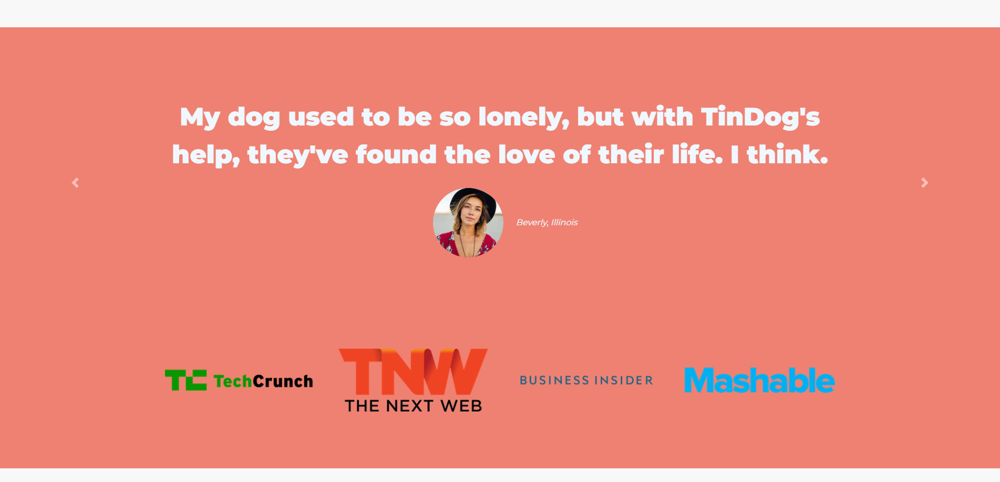
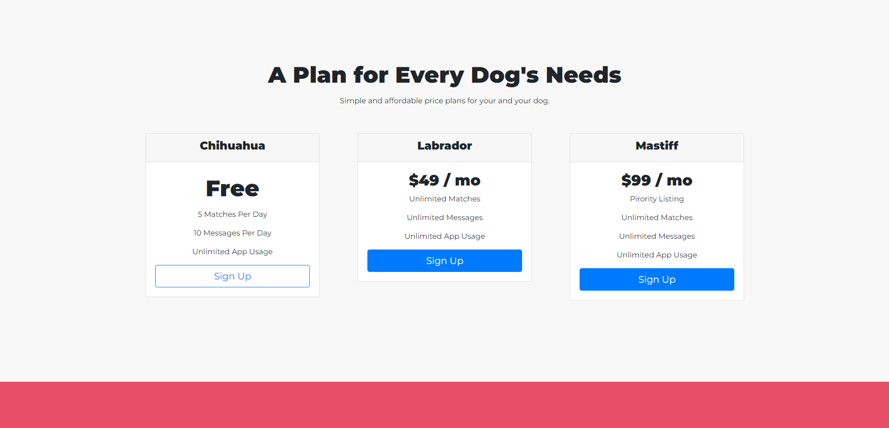
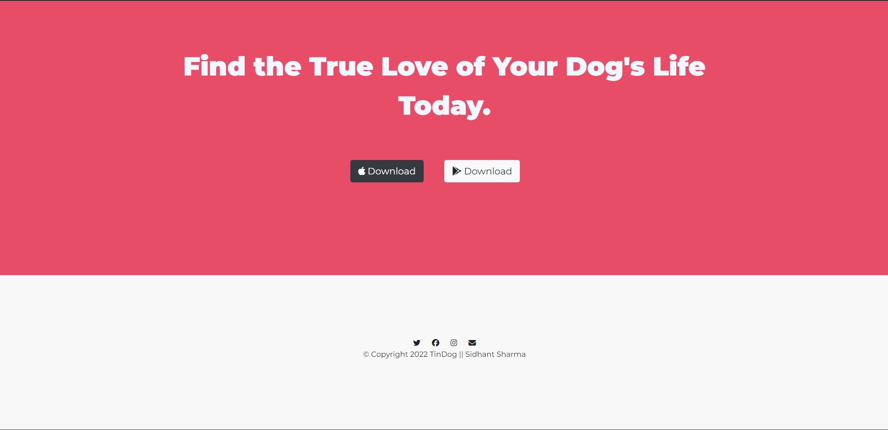

# TinDog

Welcome to TinDog - Tinder for dogs! This is a fun project inspired by Tinder, but designed for connecting dogs and their owners. Whether you're looking for playdates, friendships, or even love for your furry friends, TinDog is the place to be.

### Live Link: https://iceberg-15.github.io/tindog/

## Features

- **Swipe Cards**: Users can swipe left or right to show interest in other dogs' profiles.
- **Matches**: When two dogs express mutual interest, it's a match!
- **Profile Creation**: Create a profile for your dog with photos, breed information, and more.
- **Location-Based**: Find dogs nearby based on your location.

## Technologies Used

- **HTML/CSS**: For the frontend structure and styling.
- **Bootstrap**: To create a responsive and visually appealing design.
- **JavaScript**: To implement swipe functionality and interactive features.
- **Font Awesome**: For icons used throughout the app.

## Setup

To run TinDog locally, follow these steps:

1. **Clone the repository**:
   ```bash
   git clone https://github.com/IceBerG-15/tindog.git
   ```
2. **Go to that folder**:
   ```bash
   cd tindog
   ```
3. **Open index.html in your browser.**

## Screenshots







## Contributing

Contributions are welcome! If you have any ideas for improvements or new features, feel free to fork the repository and submit a pull request.
